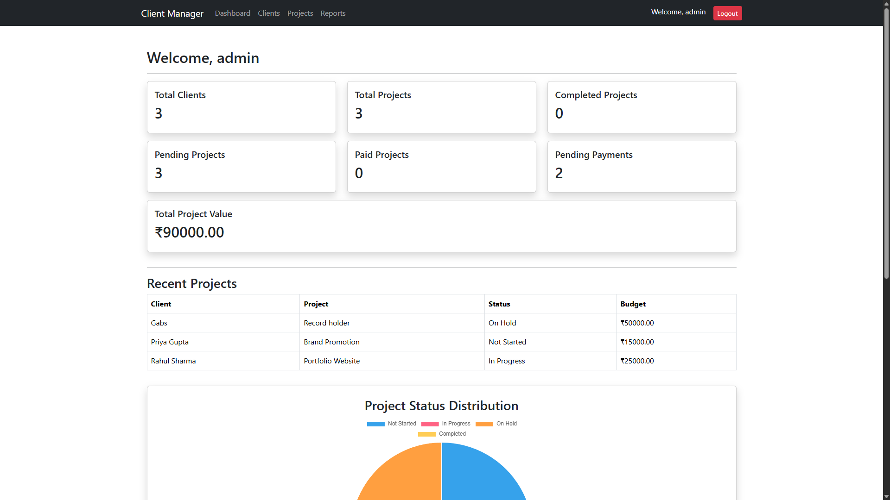
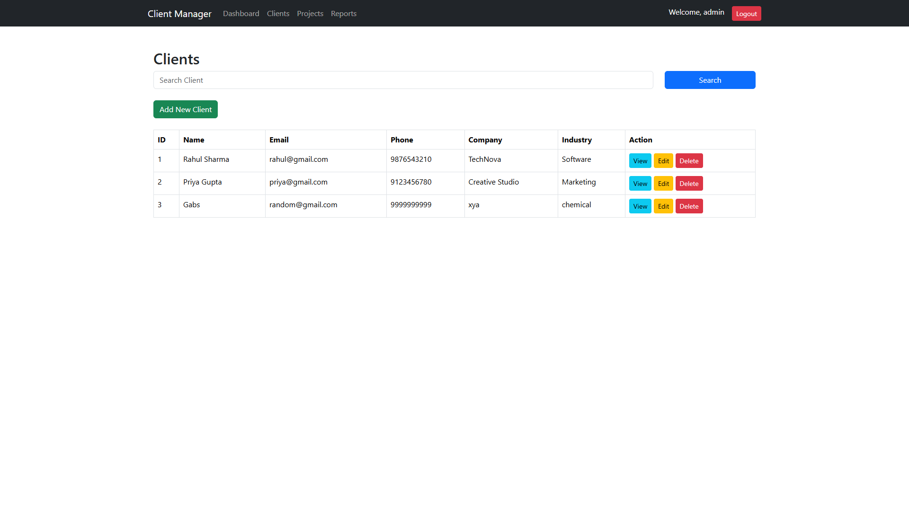
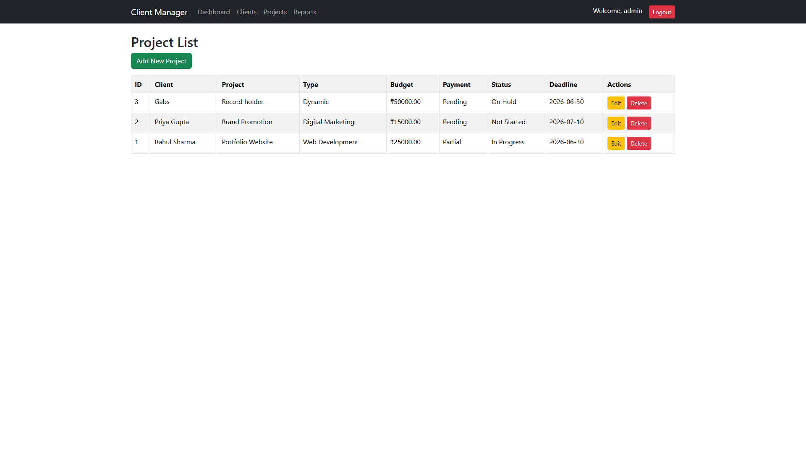
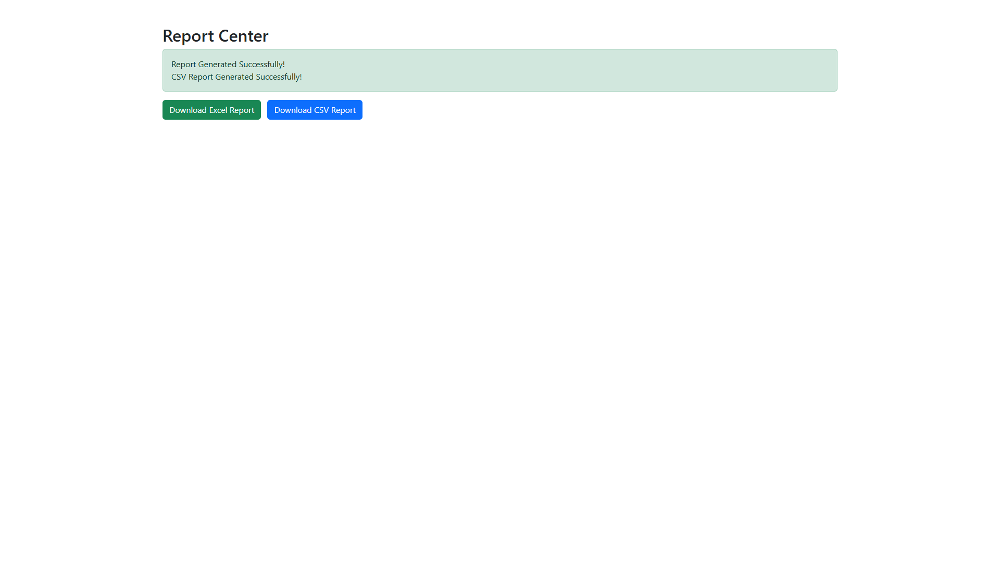

# Client & Project Management System

A full-stack CRM-style web application developed using PHP, MySQL, Bootstrap, and Python.

The system allows administrators to manage clients, track projects, monitor payments, generate reports, and visualize business analytics through interactive dashboards.

---

## Features

### Authentication
- Admin Login
- Session Management
- Secure Access Control

### Client Management
- Add Clients
- Edit Client Information
- Delete Clients
- View Client Profiles

### Project Management
- Create Projects
- Assign Projects to Clients
- Track Project Status
- Monitor Payment Status

### Dashboard Analytics
- Total Clients
- Total Projects
- Completed Projects
- Pending Projects
- Revenue Tracking
- Payment Tracking

### Interactive Charts
- Project Status Distribution (Pie Chart)
- Revenue by Client (Bar Chart)
- Built using Chart.js

### Reporting System
- Excel Report Generation using Python
- CSV Report Generation using Python
- Downloadable Reports

### Database Features
- Relational Database Design
- Client-Project Relationships
- Revenue Calculations

---

## Technologies Used

### Frontend
- HTML
- CSS
- Bootstrap 5
- JavaScript
- Chart.js

### Backend
- PHP

### Database
- MySQL

### Automation
- Python
- Pandas
- OpenPyXL

---

## Project Structure

client-manager/
│
├── clients/
├── projects/
├── reports/
├── python/
├── includes/
├── dashboard.php
├── login.php
├── logout.php
└── README.md

---

## Screenshots

### Dashboard

### Client Management

### Project Management

### Reports

---

## Future Enhancements

- Search & Filter System
- Invoice Generation
- Email Notifications
- User Roles & Permissions
- PDF Reports

---

## Author

Garvit Raj

BCA Student | PHP Developer | Python Developer
